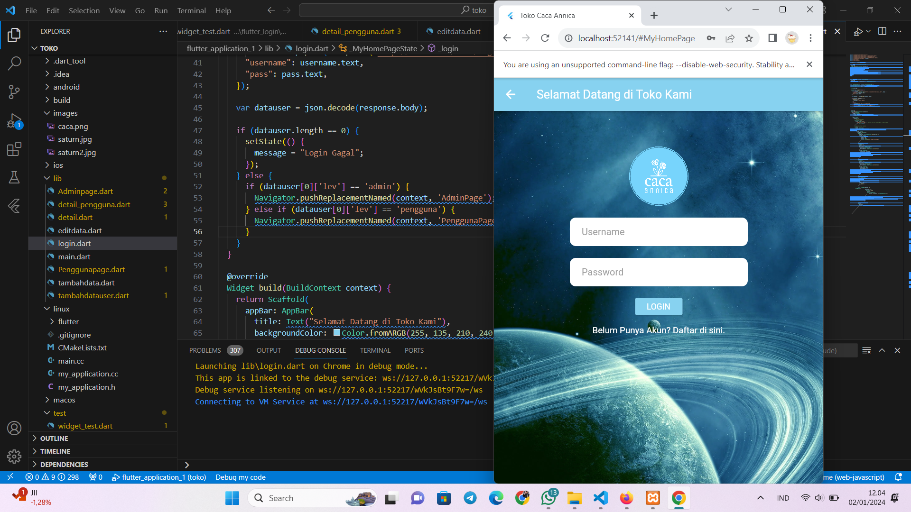

# Personal Portfolio

Welcome to my personal portfolio! This website showcases my skills, projects, and background as a Front End Web Developer. 

## Table of Contents
- [About Me](#about-me)
- [Projects](#projects)
- [Skills](#skills)
- [Contact](#contact)
- [Getting Started](#getting-started)
- [Technologies Used](#technologies-used)
- [License](#license)

## About Me
My name is **Nur Annisa Widya Pertiwi**, and I am a Front End Web Developer. Currently, I am studying Informatics Engineering at Ngudi Waluyo University. I am passionate about web development and UI/UX design, focusing on creating digital platforms that provide optimal user experiences.

### Education
- SMA Negeri 1 Tuntang (2017-2020) - MIPA Major
- Bachelor of Informatics Engineering, Ngudi Waluyo University (2022 - Present)

### Training
- **UNW - Study Club UI/UX and Web Development**

## Projects
Here are some of my featured projects:

### Project 1: Flutter

Flutter is Google's open-source framework for building cross-platform apps with a single code base. I utilized Flutter to create apps for Android, iOS, web, and desktop with optimal performance. You can check out the project on [GitHub](https://github.com/Nur-Annisa1/flutter_application_1).

## Skills
I have developed a range of skills in various programming languages and frameworks, including:

- HTML
- CSS
- JavaScript
- Laravel
- C++
- Flutter
- PHP
- MySQL
- Python
- Java
- ReactJS
- Figma

## Contact
Feel free to reach out to me through the following platforms:

- WhatsApp: [Contact Me](https://wa.me/+6283863110499)
- Instagram: [@nannssz_](https://www.instagram.com/nannssz_/)
- LinkedIn: [Nur Annisa Widya Pertiwi](https://www.linkedin.com/in/nur-annisa-136023336/)

You can also email me at [nisawidya451@gmail.com](mailto:nisawidya451@gmail.com).

## Getting Started
To view this portfolio locally, follow these steps:

1. Clone the repository:
   ```bash
   git clone https://github.com/yourusername/portfolio.git
2.Navigate to the project directory:
   cd portfolio
3. Open index.html in your browser.
Feel free to copy and paste this section into your `README.md` file!

## Technologies Used

This portfolio is built using the following technologies:

- HTML5
- CSS3
- JavaScript
- Responsive Design
- Google Fonts (Poppins)
- GitHub Pages for hosting

## Features

- Navigation Menu: Easily navigate through different sections of the portfolio.
- Home Section: Introduction and a call-to-action button to download my CV.
- About Me Section: A brief introduction about my background and education.
- Projects Section: Showcase of my projects with links to GitHub repositories.
- Skills Section: Visual representation of my technical skills.
- Contact Section: Links to my social media profiles and a contact email.

## Usage

- Navigate through the sections using the links in the navigation bar.
- Click on the project links to view more details and access the GitHub repositories.
- Use the contact buttons to reach out via WhatsApp, Instagram, or LinkedIn.

## Contact

Feel free to reach out to me through the following channels:

- Email: [nisawidya451@gmail.com](mailto:nisawidya451@gmail.com)
- WhatsApp: [Contact me on WhatsApp](https://wa.me/+6283863110499)
- Instagram: [@nannssz_](https://www.instagram.com/nannssz_/)
- LinkedIn: [Nur Annisa Widya Pertiwi](https://www.linkedin.com/in/nur-annisa-136023336/)

 
### Instructions:
- Replace `yourusername` in the clone command with your actual GitHub username.
- You can modify any section to better suit your preferences or additional information you want to include.

### Notes:
- Make sure to replace `yourusername` in the GitHub clone link with your actual GitHub username.
- Adjust any links or descriptions as necessary to fit your project and personal branding. 
- Include a `LICENSE` file if you're planning to share your project publicly.

